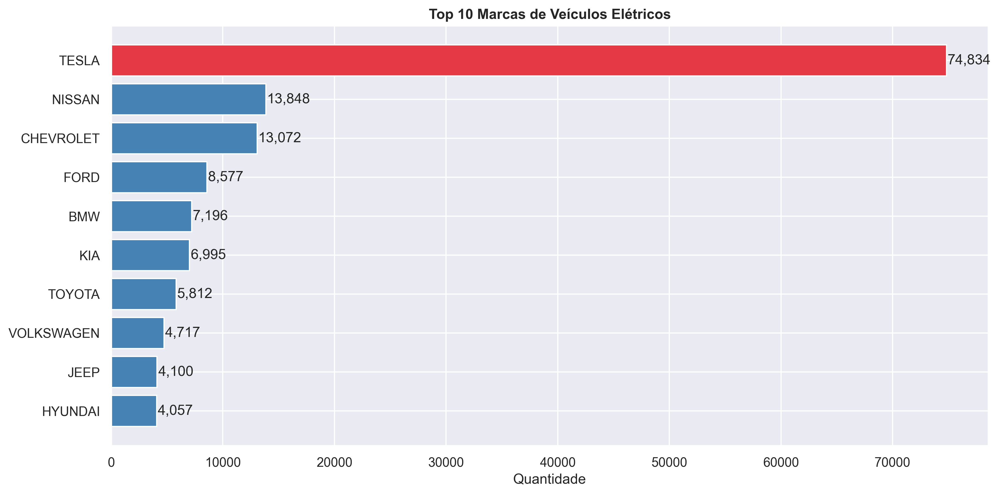
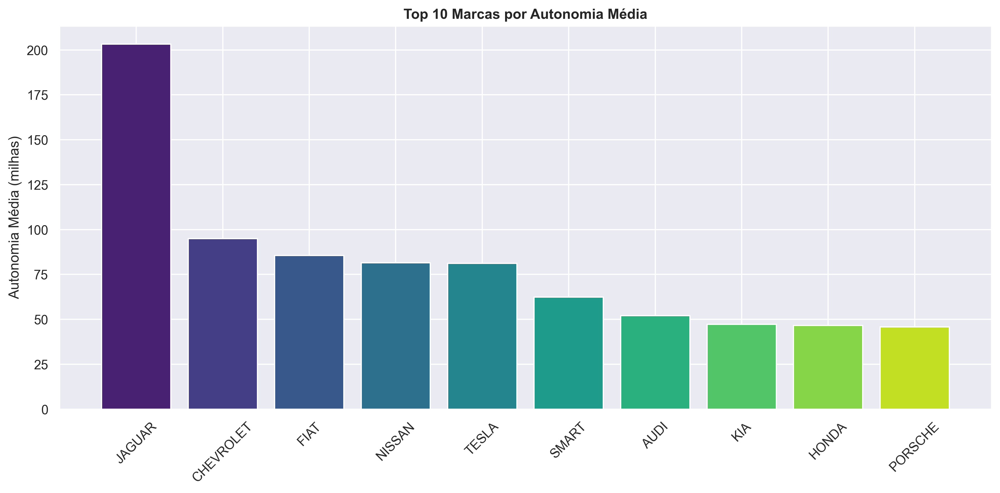
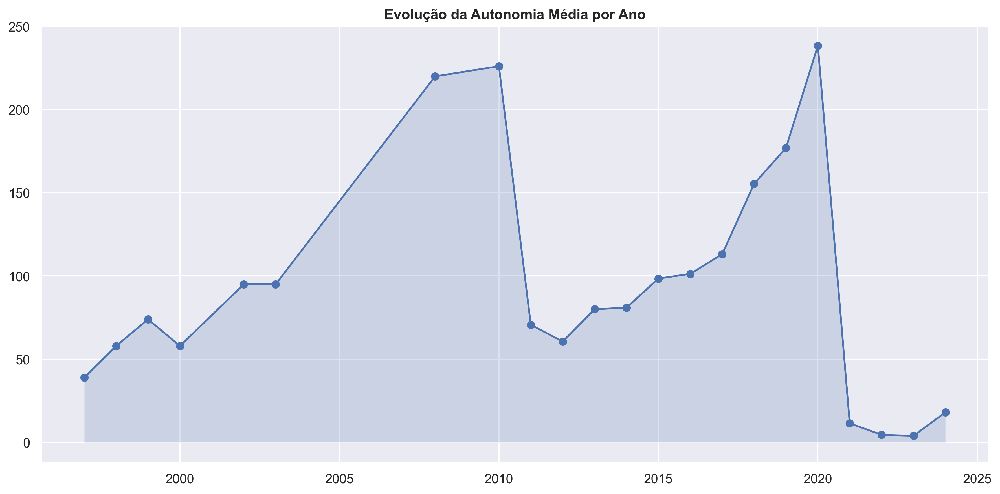
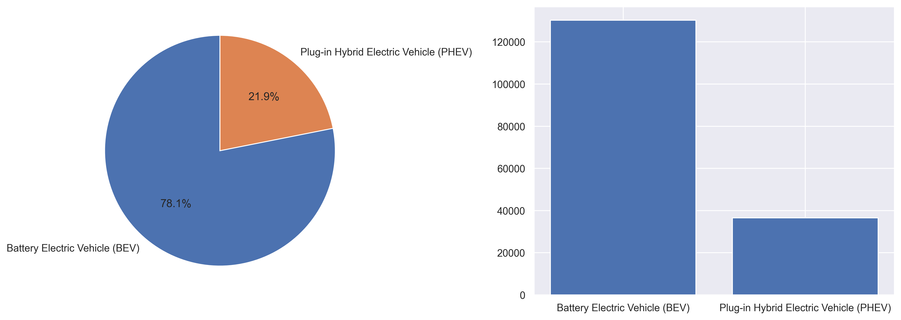
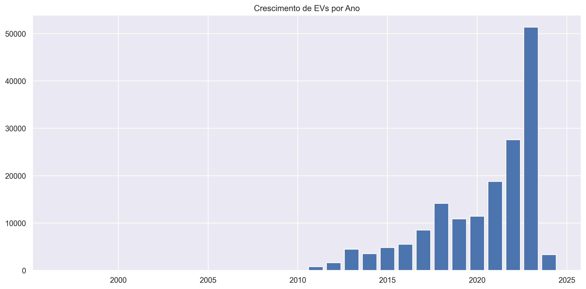
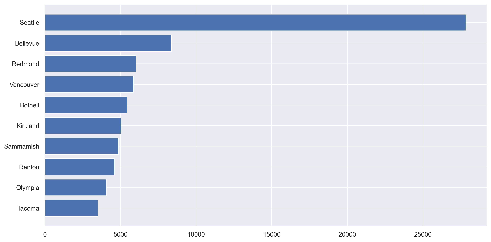
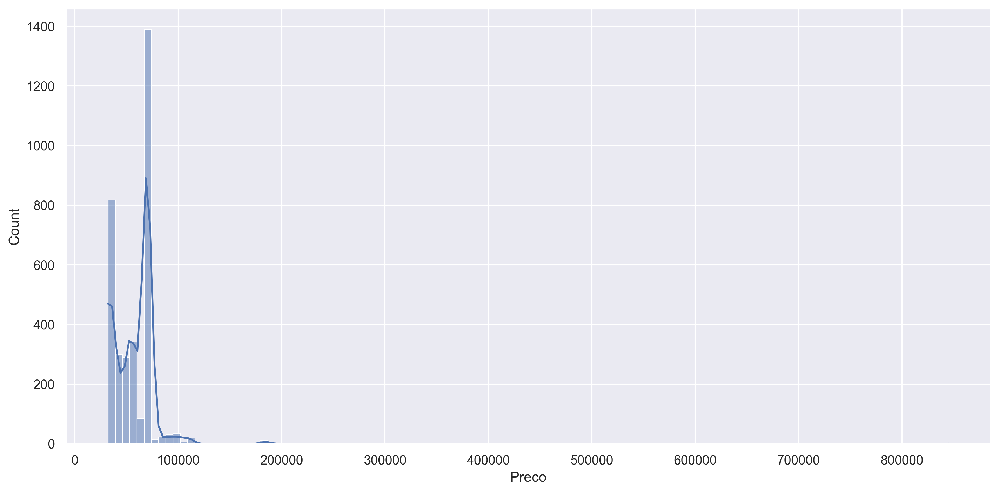
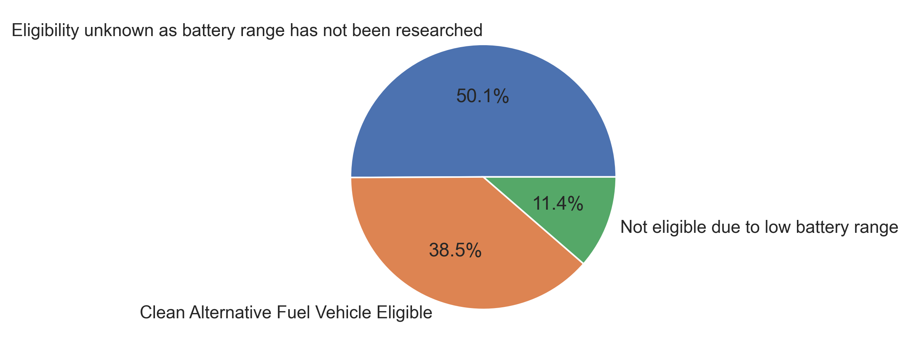

# 🚗🔋 ANÁLISE DE VEÍCULOS ELÉTRICOS — Washington State DOL

## 📌 Sobre o Projeto

Este projeto realiza uma análise exploratória de dados (EDA) sobre veículos elétricos registrados no estado de Washington, utilizando dados do Department of Licensing (DOL).

O objetivo é identificar padrões relevantes no crescimento da frota elétrica, comportamento do mercado, evolução tecnológica e impacto de políticas públicas.

---

## 🎯 Objetivos

- Analisar a distribuição de veículos elétricos por marca  
- Avaliar a evolução da autonomia ao longo dos anos  
- Comparar tipos de veículos (BEV vs PHEV)  
- Identificar crescimento do mercado  
- Mapear concentração geográfica  
- Avaliar impacto de incentivos governamentais (CAFV)  

---

## 🛠️ Tecnologias Utilizadas

- Python  
- Pandas  
- Matplotlib  
- Seaborn  
- Jupyter Notebook  

---

## 📊 Análises Realizadas

---

### 🚘 Top 10 Marcas



**Análise:**

A distribuição revela uma forte concentração de mercado, com destaque para a Tesla como líder dominante. Isso sugere vantagem competitiva consolidada, possivelmente associada à tecnologia, infraestrutura e reconhecimento de marca.

Outras fabricantes aparecem com menor participação, indicando que o mercado ainda não está totalmente pulverizado.

**Insights:**
- Alta concentração de mercado  
- Presença dominante de poucos players  
- Barreiras de entrada relevantes  

---

### ⚡ Autonomia Média por Marca



**Análise:**

Existe uma variação significativa na autonomia média entre as marcas. Fabricantes com maior autonomia tendem a ocupar segmentos mais premium.

Isso evidencia que autonomia é um fator estratégico e diferencial competitivo.

**Insights:**
- Correlação entre autonomia e posicionamento de mercado  
- Marcas premium lideram inovação  
- Estratégias diferentes entre fabricantes (custo vs performance)  

---

### 📈 Evolução da Autonomia ao Longo dos Anos



**Análise:**

A autonomia média dos veículos apresenta crescimento consistente ao longo do tempo, indicando evolução tecnológica contínua, especialmente no desenvolvimento de baterias.

A ausência de quedas relevantes sugere um avanço estável e progressivo.

**Insights:**
- Tecnologia em constante evolução  
- Redução da ansiedade de autonomia (range anxiety)  
- Tendência positiva de longo prazo  

---

### 🔌 BEV vs PHEV



**Análise:**

Os veículos 100% elétricos (BEV) predominam sobre os híbridos plug-in (PHEV), indicando uma transição clara do mercado para eletrificação total.

Os PHEVs ainda aparecem como alternativa intermediária.

**Insights:**
- Mercado migrando para veículos totalmente elétricos  
- PHEVs podem perder relevância no futuro  
- Influência de incentivos governamentais  

---

### 📊 Crescimento de Registros por Ano



**Análise:**

O crescimento de registros apresenta comportamento acelerado, sugerindo uma possível tendência exponencial.

Esse padrão é típico de mercados emergentes impulsionados por inovação e políticas públicas.

**Insights:**
- Forte expansão do mercado  
- Adoção crescente de veículos elétricos  
- Influência de incentivos e conscientização ambiental  

---

### 🌆 Top 10 Cidades com Mais EVs



**Análise:**

A concentração de veículos elétricos em grandes centros urbanos indica dependência de infraestrutura de recarga e incentivos locais.

Regiões urbanas lideram a adoção.

**Insights:**
- Infraestrutura é fator crítico  
- Adoção desigual entre regiões  
- Potencial de crescimento fora dos grandes centros  

---

### 💰 Distribuição de Preços



**Análise:**

A distribuição mostra concentração em faixas intermediárias, com presença de veículos de alto valor.

Isso indica que o mercado está se tornando mais acessível, mas ainda mantém um segmento premium relevante.

**Insights:**
- Processo de democratização do mercado  
- Presença de outliers (veículos de luxo)  
- Redução gradual da barreira de entrada  

---

### 🧩 Elegibilidade CAFV



**Análise:**

A maior parte dos veículos é elegível para incentivos CAFV, indicando alinhamento entre o mercado e políticas públicas ambientais.

Fabricantes parecem adaptar seus modelos para atender critérios de elegibilidade.

**Insights:**
- Incentivos governamentais eficazes  
- Forte influência da regulação no mercado  
- Impacto direto na oferta de veículos  

---

## 🧠 Conclusão

A análise revela um mercado em rápida expansão, sustentado por avanços tecnológicos e incentivos governamentais.

**Principais conclusões:**

- 📈 Crescimento acelerado do setor  
- 🔋 Evolução contínua da autonomia  
- 🚘 Forte concentração em grandes marcas  
- 🌎 Transição clara para eletrificação total  
- 🏙️ Adoção concentrada em áreas urbanas  

---

## 🚀 Próximos Passos

- Análise preditiva de crescimento do mercado  
- Modelagem de preço vs autonomia  
- Clusterização de veículos por perfil  
- Análise de impacto ambiental  

---

## 📂 Como Executar

```bash
# Clone o repositório
git clone https://github.com/seu-usuario/seu-repo.git

# Entre na pasta
cd seu-repo

# Instale as dependências
pip install -r requirements.txt

# Execute o notebook
jupyter notebook